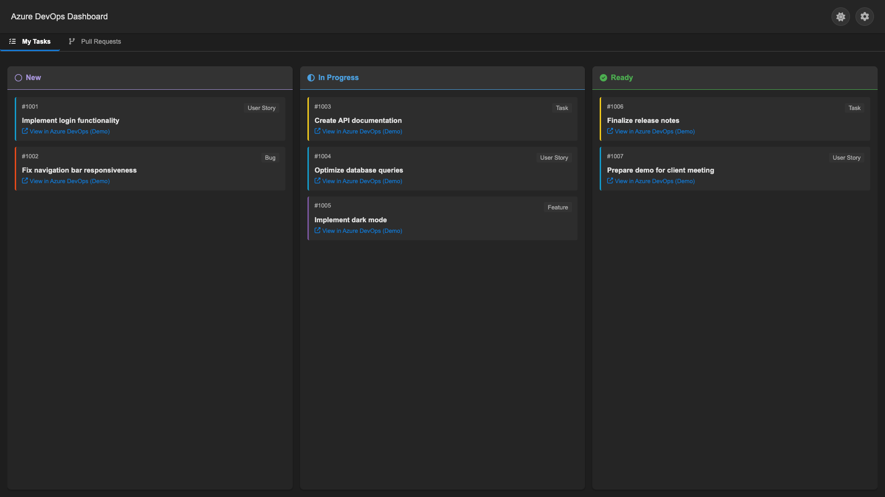
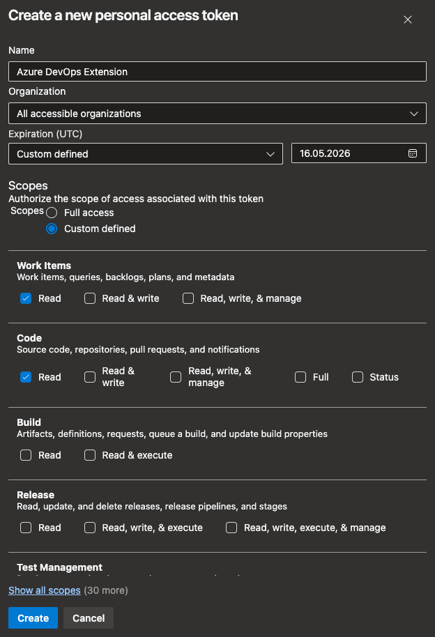
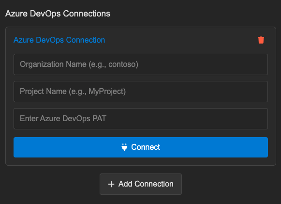
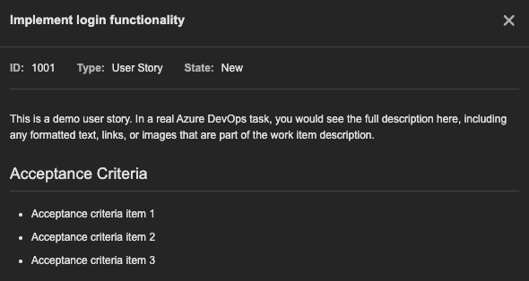
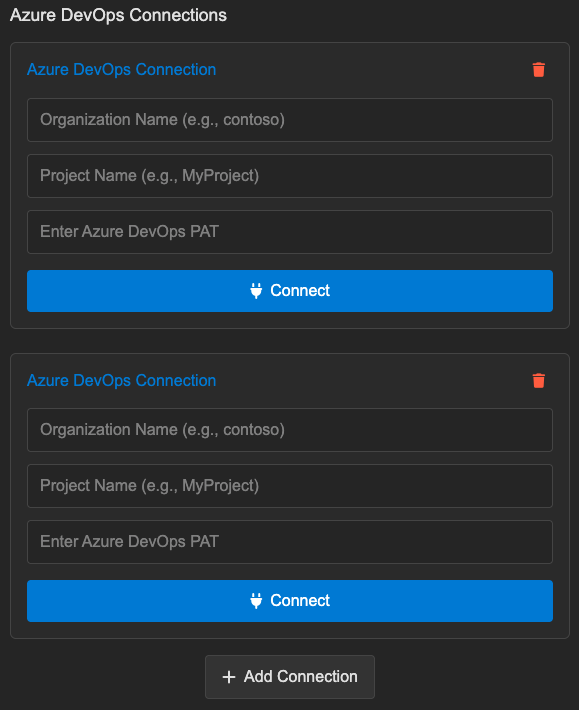

# Azure DevOps Tasks Chrome Extension

A Chrome extension that brings your Azure DevOps tasks directly into your browser. View and manage your tasks without switching contexts, right in your browser's new tab or with a simple click.

 

## Features

- **Kanban Board View**: View your tasks in an intuitive kanban board layout
- **Real-time Updates**: Automatic sync with Azure DevOps
- **New Tab Integration**: Access tasks every time you open a new tab
- **Multiple Connections**: Connect to multiple Azure DevOps organizations and projects
- **Dark Mode Support**: Switch between light and dark themes
- **Customizable Display**: Choose between new tab, popup, or both

## Installation

1. Visit the [Chrome Web Store](https://chrome.google.com/webstore/detail/your-extension-id) to install the extension
2. Click "Add to Chrome" to install

## Setup

1. **Create a Personal Access Token (PAT)**:

   - Go to your Azure DevOps organization settings
   - Create a PAT with these scopes:
     - Work Items (Read)
     - Boards (Read)
     - Code (Read)

   

2. **Configure the Extension**:

   - Click the extension icon in Chrome
   - Click the gear icon to open settings
   - Add your connection details:
     - Organization Name
     - Project Name
     - Personal Access Token

   

3. **Choose Display Preferences**:

   - New Tab only
   - Popup only
   - Both New Tab and Popup

   

## Usage

### Viewing Tasks

- Open a new tab or click the extension icon to see your tasks
- Tasks are displayed in a kanban board with columns for different states
- Click any task to view its full details

### Task Details

- View task description
- See acceptance criteria
- Check metadata
- Open in Azure DevOps with one click

### Multiple Organizations

- Add multiple Azure DevOps connections
- View tasks from all organizations in one board
- Switch between organizations easily

## Support

If you need help or have questions:

- Email: steffen.hofbauer@googlemail.com
- GitHub: [Report Issues](https://github.com/iTzSteffen/azure-devops-tasks-extension-website)
- Check the [FAQ section](index.html#faq) for common questions

## Privacy & Security

- Your PAT is stored securely in Chrome's storage
- All communication with Azure DevOps is over HTTPS
- No data is stored on external servers
- You can revoke access at any time

## Related Links

- [Chrome Web Store Listing](https://chrome.google.com/webstore/detail/your-extension-id)
- [GitHub Repository](https://github.com/iTzSteffen/azure-devops-tasks-extension)
- [Privacy Policy](privacy.html)
- [Terms of Service](terms.html)

## License

This project is licensed under the MIT License.
